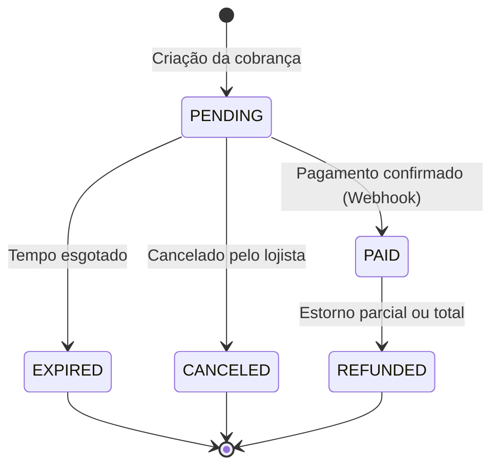

# Fase 4: Test Design - Projetando antes de automatizar

## 01. O que você vai aprender
Nesta fase, daremos um passo atrás do código puro para focar em **Engenharia de Qualidade**. Você aprenderá como arquitetar seus testes de API antes de escrever uma única linha de código utilizando técnicas consagradas de Test Design. Especificamente, dominaremos:
- **Particionamento de Equivalência** e **Análise de Valor Limite** aplicados a APIs financeiras.
- **Transição de Estado (State Transition)**, a espinha dorsal de qualquer sistema de pagamentos.
- **Data-Driven Testing (DDT)** no Playwright, permitindo testar dezenas de cenários com um único bloco de código, mantendo a manutenibilidade.

## 02. Por que isso importa para um QA
Em sistemas de pagamento (Gateways, Adquirentes, Bancos), você não pode simplesmente testar o "caminho feliz e um cenário de erro" e considerar a tarefa concluída. O custo de um falso positivo (aprovar uma transação que deveria ser recusada) ou de um falso negativo (recusar uma transação legítima) reflete-se em prejuízo financeiro direto e perda de confiança do cliente.

Projetar seus testes através de técnicas matemáticas (como Análise de Valor Limite) garante que você descubra os *edge cases* (casos extremos) críticos sem precisar criar milhares de testes redundantes. Além disso, entender Transição de Estado impede que ocorram falhas arquiteturais graves — como conseguir cancelar um PIX que já foi liquidado e pago ao recebedor. Um SDET focado em pagamentos se diferencia não por saber "codar", mas por saber **exatamente o que** codar.

## 03. Pré-requisitos
- Compreensão sólida sobre requisições HTTP e métodos (Fase 1 e Fase 2).
- Ambiente Playwright configurado e rodando testes básicos (Fase 3).
- Conhecimento básico sobre arrays e iterações (loops) em JavaScript/TypeScript.

## 04. Conceitos
- **Particionamento de Equivalência (EP):** Consiste em dividir os dados de entrada em grupos (partições) onde o sistema deve ter um comportamento idêntico para todos os valores daquele grupo. Se um valor da partição funciona, assumimos que os outros também funcionarão. Reduz a quantidade de testes necessários.
- **Análise de Valor Limite (BVA):** Bugs adoram se esconder nas fronteiras das regras de negócio. Essa técnica foca em testar exatamente o limite inferior, o limite superior, e os valores imediatamente abaixo e acima desses limites.
- **Tabela de Transição de Estado:** Sistemas financeiros são máquinas de estado. Uma transação possui um "ciclo de vida". A transição mapeia de qual estado uma entidade pode ir para o próximo, validando caminhos legais e barrando transições ilegais.
- **Data-Driven Testing (DDT):** Abordagem onde a lógica de teste é separada da massa de dados. O mesmo script de teste é executado várias vezes de forma automatizada, alimentado por uma lista ou arquivo externo (JSON/CSV) com diferentes inputs e outputs esperados.

## 05. Explicação mastigada

Imagine que você está testando uma API de transferências bancárias onde a regra diz: *"Transferências permitidas para valores entre R$ 1,00 e R$ 10.000,00"*.

**Aplicando Equivalência e Valor Limite:**
- **Partições Inválidas:** Valores < 1,00 e Valores > 10.000,00.
- **Partição Válida:** Valores entre 1,00 e 10.000,00.
Em vez de testar R$ 5,00; R$ 10,00; R$ 500,00 (todos na mesma partição válida), você testa as bordas exatas:
1. `0.99` (Limite Inferior - Inválido)
2. `1.00` (Limite Inferior - Válido)
3. `10000.00` (Limite Superior - Válido)
4. `10000.01` (Limite Superior - Inválido)

**Aplicando Transição de Estado:**
Uma transação nasce `PENDING`. Se o cliente paga, vai para `PAID`. Se não paga, vai para `EXPIRED`.
Você não pode ir de `EXPIRED` para `PAID` (o QR Code já venceu!). Você não pode ir de `PAID` para `PENDING`. Testar essas transições **inválidas** é tão importante quanto testar o caminho feliz. No mundo de pagamentos, fraudes geralmente ocorrem explorando transições de estado mal validadas.

## 06. Exemplos

### Máquina de Estados de um PIX
No desenvolvimento de Testes, é comum validarmos essa máquina de estados que criamos abaixo:



Transições Ilegais que devemos testar e garantir que retornem HTTP 400/409 (Conflict/Bad Request):
- `PAID` -> `CANCELED` (Não se cancela o que já está pago, se estorna `REFUNDED`).
- `EXPIRED` -> `PAID` (Se pagou depois de vencido, o sistema deve recusar a conciliação).
- `REFUNDED` -> `PAID` (Não pode ser "repago" após devolução).

## 07. Código comentado

Abaixo, vemos como implementar **Data-Driven Testing (DDT)** no Playwright para testar Valores Limites na API de transações, de forma limpa e escalável.

```typescript
import { test, expect } from '@playwright/test';

// 1. Definimos nossos casos de teste num Array de objetos (Massa de Dados / DDT)
const transactionScenarios = [
  { description: 'Abaixo do limite mínimo', amount: 0.99, expectedStatus: 400, expectedCode: 'INVALID_AMOUNT' },
  { description: 'Exatamente no limite mínimo', amount: 1.00, expectedStatus: 201, expectedCode: 'SUCCESS' },
  { description: 'Valor mediano válido', amount: 5000.00, expectedStatus: 201, expectedCode: 'SUCCESS' },
  { description: 'Exatamente no limite máximo', amount: 10000.00, expectedStatus: 201, expectedCode: 'SUCCESS' },
  { description: 'Acima do limite máximo', amount: 10000.01, expectedStatus: 400, expectedCode: 'LIMIT_EXCEEDED' }
];

test.describe('API de Pagamentos - Análise de Valor Limite', () => {
  
  // 2. Iteramos sobre o array. O Playwright criará 5 testes dinamicamente!
  for (const scenario of transactionScenarios) {
    
    // O nome do teste muda de acordo com o cenário iterado
    test(`Deve processar a transação: ${scenario.description} (Valor: ${scenario.amount})`, async ({ request }) => {
      
      const payload = {
        receiver_id: "loja_123",
        amount: scenario.amount,
        currency: "BRL"
      };

      const response = await request.post('/v1/transactions', { data: payload });
      
      // 3. Validações flexíveis baseadas no estado esperado do cenário
      expect(response.status()).toBe(scenario.expectedStatus);
      
      const responseBody = await response.json();
      expect(responseBody.code).toBe(scenario.expectedCode);
    });
  }
});
```

> [!IMPORTANT]
> No Playwright, a iteração `for` deve ficar **fora** do bloco `test()`, mas **dentro** de `test.describe()`. Se você colocar o `for` dentro do bloco `test()`, ele fará um único teste gigantesco em vez de testes isolados, perdendo todo o poder de relatórios granulares e falhando o teste na primeira ocorrência.

## 08. Exercício guiado (Nível 1 - Guided)

**Objetivo**: Criar um Teste de Transição de Estado que garanta que não podemos estornar (`REFUND`) uma transação que ainda está pendente (`PENDING`).

**Instruções:**
1. Crie um arquivo `state-transition.spec.ts`.
2. Escreva um teste que cria uma transação (`POST /transactions`). A transação nascerá `PENDING`.
3. Imediatamente após criar, tente chamar a rota de estorno (`POST /transactions/{id}/refund`).
4. Valide se a API retorna um Erro 409 (Conflict) ou 400 (Bad Request) com uma mensagem explicando que o status atual não permite estorno.

```typescript
import { test, expect } from '@playwright/test';

test('Não deve permitir estornar (REFUND) uma transação PENDING', async ({ request }) => {
  // Passo 1: Criar transação
  const createRes = await request.post('/v1/transactions', {
    data: { amount: 100.00 }
  });
  const transaction = await createRes.json();
  
  // Garantir que está PENDING
  expect(transaction.status).toBe('PENDING');

  // Passo 2: Tentar estornar diretamente
  const refundRes = await request.post(`/v1/transactions/${transaction.id}/refund`);
  
  // Passo 3: Validar a transição ilegal bloqueada
  expect(refundRes.status()).toBe(409); // Ou 400, dependendo da sua API mockada
  const errorBody = await refundRes.json();
  expect(errorBody.message).toContain('invalid state transition');
});
```

## 09. Exercício sozinho (Nível 2 - Semi-guided)

**Desafio:** Testar a regra de parcelamento de cartão de crédito usando DDT.
A regra de negócio diz: *Compras no crédito podem ser parceladas de 1x a 12x.*

1. Crie uma matriz de objetos de teste contemplando os Limites (BVA) para a chave `installments` (parcelas).
2. Quais valores você testaria? Sugestão: `0`, `1`, `6` (classe válida), `12`, `13`.
3. Escreva o laço de repetição `for` do Playwright e chame o endpoint `POST /v1/credit-card/payments` passando os `installments` vindos da matriz.
4. Valide as respostas (Erros 400 para as fronteiras externas, Sucesso 201 para as fronteiras internas e válidas).

## 10. Desafio (Nível 3 - Challenge)

**O Teste do Webhook Malicioso**
Em APIs de pagamentos, os Webhooks (notificações de mudança de estado) são cruciais.
Você precisa provar que o sistema é resiliente a eventos enviados fora de ordem (Transição de Estado corrompida).

Crie uma suite que faz o seguinte:
1. Cria uma transação (Fica `PENDING`).
2. Envia um Webhook (via POST em rota de simulação, ex: `/v1/webhooks/pix`) forçando o status `EXPIRED`.
3. Verifica via `GET` se a transação está `EXPIRED`.
4. Em seguida, envia *outro* Webhook para a mesma transação forçando o status `PAID`. (Tentativa de golpe: aprovar um pedido expirado).
5. A API deve rejeitar o segundo webhook, e num `GET` posterior, o status deve permanecer invicto como `EXPIRED`.

*Dica: Você estará garantindo a idempotência e integridade da máquina de estados do Gateway!*

## 11. Erros comuns

- **Fazer For-Loops dentro da função `test`:** Como visto na seção de código, loop dentro do teste gera um log unificado. Se falhar no índice 3, os testes 4 e 5 nem executam. Sempre use o loop ao redor da função `test`.
- **Testar excesso de dados repetidos:** Criar DDT com parcelas de 1 a 12. Pela regra de Equivalência, testar 1, 6 e 12 já garante 99.9% de confiança. Testar todos torna a suíte lenta (isso se chama Testagem Exaustiva e é um anti-pattern).
- **Esquecer os valores negativos e quebras de tipo:** Testar BVA com `-1` ou passando um `string` no lugar do valor financeiro (ex: `"100.00"` invés de `100.00`).

## 12. Debugging

- **DDT muito grande quebrando:** Quando você tem 50 cenários no DDT e um deles falha, você não quer rodar os outros 49 enquanto tenta arrumar. Para focar, adicione uma tag exclusiva em sua matriz (ex: `only: true`) ou modifique o arquivo no momento temporariamente:
  ```typescript
  // Adicione apenas para debugar um caso específico
  test.only(`Deve processar a transação: ${scenario.description}`, async () => { ... })
  ```
- **Rastreando Transição de Estado:** Se o estado final não for o esperado, print os passos: `console.log('Estado após Step 1:', responseBody.status)`. Muitas vezes, a API retorna sucesso mas de forma assíncrona o banco ainda não processou. 

## 13. Aplicação no projeto principal

No projeto de API final do curso, aplicaremos BVA fortemente nas rotas de *Cash-out* (Saques/Transferências), garantindo que o saldo disponível na conta do Lojista (Account Balance) não possa ficar negativo e respeite limites diários de saque estipulados por regras de Banco Central. Também documentaremos a máquina de estados para os *Chargebacks* (Contestações de Cartão).

## 14. Perguntas de entrevista

1. **"Qual a diferença entre Boundary Value Analysis e Equivalence Partitioning?"**
   *R: O particionamento agrupa dados de entrada em classes que possuem comportamento similar para reduzir o número de testes. O BVA atua nas bordas dessas classes, testando os limites exatos (inferior e superior) e os valores imediatamente adjacentes, pois é onde a maioria dos defeitos de código costuma ocorrer (ex: usar `<` em vez de `<=`).*

2. **"Como você garantiria a cobertura de testes em um sistema de mudança de status de Pedidos?"**
   *R: Utilizaria a técnica de Tabela de Transição de Estado (State Transition). Mapearia todos os estados válidos e eventos (triggers), criaria testes para cada caminho válido, e criaria cenários negativos (Data-Driven) tentando forçar o sistema a realizar todas as transições impossíveis a partir de um determinado estado.*

## 15. Checklist
- [ ] Entendi a diferença de Equivalence Partitioning e BVA.
- [ ] Construí um array de cenários (Massa de Dados) para aplicar DDT.
- [ ] Coloquei o loop `for/of` no lugar correto no Playwright.
- [ ] Escrevi cenários validando o bloqueio de transições de estado impossíveis.

## 16. Critério para avançar
Você pode avançar quando rodar seu script Data-Driven (DDT) de BVA e ver múltiplos testes sendo gerados a partir de um único bloco no Report do Playwright. Seu entendimento sobre transição de status deve estar claro, pois isso pautará a construção dos Mocks e Webhooks das próximas etapas.
